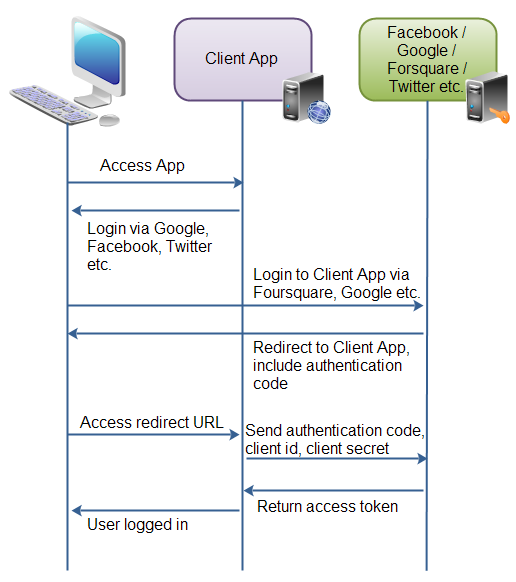

**This is a short description of OAuth2 protocol covering its high level architecture.**

1.The user accesses the client web application. In this web app is button saying "Login via Facebook" (or some other system like Google or Twitter).

2.When the user clicks the login button, the user is redirected to the authenticating application (e.g. Facebook). The user then logs into the authenticating application, and is asked if she wants to grant access to her data in the authenticating application, to the client application. The user accepts.

3.The authenticating application redirects the user to a redirect URI, which the client app has provided to the authenticating app. Providing this redirect URI is normally done by registering the client application with the authenticating application. During this registration the owner of the client application registers the redirect URI. It is also during this registration that the authenticating application gives the client application a client id and a client password. To the URI is appended an authentication code. This code represents the authentication.

4.The user accesses the page located at the redirect URI in the client application. In the background the client application contacts the authenticating application and sends client id, client password and the authentication code received in the redirect request parameters. The authenticating application sends back an access token.

Once the client application has obtained an access token, this access token can be sent to the Facebook, Google, Twitter etc. to access resources in these systems, related to the user who logged in.

This material is taken from http://tutorials.jenkov.com/oauth2/overview.html[http://tutorials.jenkov.com/oauth2/overview.html].